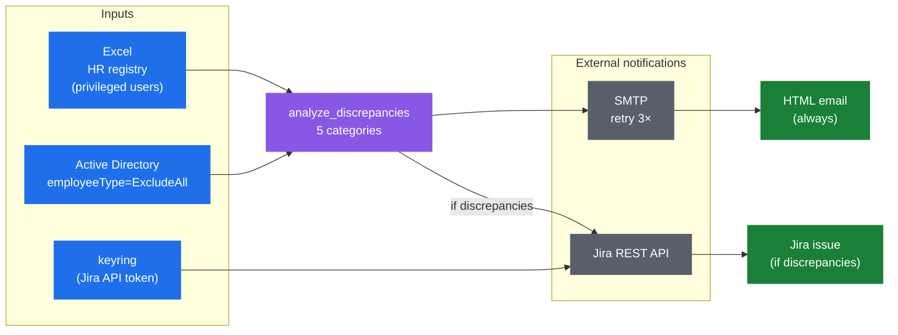

# AD ↔ HR Registry Sync Checker

Скрипт сверяет привилегированные учётные записи в **Active Directory**
(c атрибутом `employeeType=ExcludeAll`) с **HR-реестром** (Excel-файл),
выявляет расхождения и автоматически создаёт задачу в **Jira** + рассылает
HTML-отчёт по email.

Решает SOC-задачу: атрибут `ExcludeAll` исключает учётку из общих GPO/политик
(используется для технологических УЗ интеграций или администраторов).
Список ведётся в Excel и должен соответствовать тому, что реально стоит
в AD. Скрипт превращает квартальный ручной аудит в автоматический
еженедельный прогон.

## Что выявляет

| Категория | Что значит |
|-----------|------------|
| `missing_in_registry` | Есть в AD с `ExcludeAll`, но нет в реестре (теневая привилегия) |
| `disabled_in_ad` | В реестре активна, но в AD `Account Disabled` |
| `missing_in_ad` | В реестре активна, но в AD не найдена среди `ExcludeAll` |
| `withdrawn_in_excel` | В реестре статус «изъято», но в AD `ExcludeAll` ещё стоит |
| `expired_list` | Истёк `срок до` — нужно либо продлить, либо снять |

Скрипт работает **только на чтение** — никаких изменений в AD не вносит.

## Архитектура



Скрипт читает Excel-реестр привилегированных учёток и Active Directory
(только пользователи с атрибутом `employeeType=ExcludeAll`), сравнивает
по 5 категориям расхождений и формирует HTML-отчёт с отправкой по email
через SMTP с retry. Если найдены расхождения — дополнительно создаёт
задачу в Jira со связью к родительской квартальной задаче.

**Jira-логика:** ищется родительская квартальная задача по JQL, создаётся
новый тикет с детальным отчётом в Wiki Markup, связывается через `Связано
с`. Если расхождений нет — Jira не дёргается, только email.

**Email:** HTML-тело со статистикой и таблицами по каждой категории.
Retry с задержкой при сбоях SMTP. Критические сбои самого скрипта
отдельно отправляются с traceback.

**Безопасность:** DRY-RUN режим: ничего не отправляется, всё пишется
в `dry_run_email.html` / `dry_run_jira.txt`. Ротация лог-файла атомарная
(через временный файл), по умолчанию хранятся последние 60 дней.

## Хранение секретов

API-токен Jira хранится в **`keyring`** (на Windows — Credential Manager).
В коде токена нет. Утилита `set_jira_auth.py` запрашивает токен интерактивно,
проверяет соединение и сохраняет — это нужно сделать один раз. После этого
скрипт запускается автоматически (Task Scheduler или аналог) без участия
пользователя.

## Использование

```bash
python -m venv .venv
.venv\Scripts\activate
pip install -r requirements.txt

python set_jira_auth.py          # один раз — сохранить API-токен в keyring
python check_hrad_users.py        # боевой запуск
python check_hrad_users.py --dry-run    # тестовый прогон без отправки
```

## Настройка

В `hrad_config.py` под свою инфраструктуру:

```python
"excel_path":   Path(r"C:\Reports\InfoSec\Registries\Exclusions.xlsx"),
"sheet_name":   "HR_AD_ExcludeAll",
"base_dn":      "DC=corp,DC=local",
"jira_server":  "https://jira.example.com",
"smtp_server":  "smtp.corp.local",
"from_email":   "soc@example.com",
"to_emails":    ["soc@example.com"],
```

Также см. `jira_quarterly_task_jql` — JQL для родительского тикета
периодического контроля.

## Платформа

Только **Windows** — используется `pyad`, требующий COM-объект `IADs`.
Под Linux/macOS можно заменить `pyad.adquery` на `ldap3` с теми же
LDAP-фильтрами.

## Технологии

Python 3.14+, `pyad` (AD), `pandas` + `openpyxl` (Excel),
`jira` (Atlassian REST API), `keyring`, `smtplib`.


## Лицензия

MIT — см. файл [LICENSE](LICENSE).

## Disclaimer

Это обезличенный сэмпл кода для технических собеседований. Оригинальный
проект разрабатывался автором в рамках работы по информационной
безопасности. История коммитов оригинального репозитория не публикуется —
здесь представлена итоговая версия с заменёнными корпоративными
идентификаторами (домены, имена серверов, логины) на нейтральные
плейсхолдеры (`corp.local`, `example.com`, `j.doe` и т.п.).

Бизнес-правила (значения статусов, формат дат `ДД.ММ.ГГГГ`, шаблон JQL
квартального тикета) специфичны для конкретного процесса — перед
использованием в своей инфраструктуре нужно адаптировать конфигурационные
параметры под свою среду.

Excel-реестры с реальными ФИО/логинами — персональные данные и не должны
выкладываться вместе с кодом.

